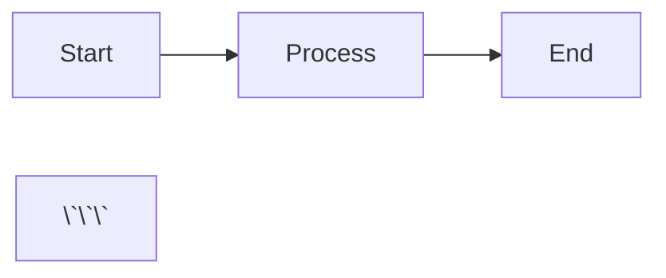

# Flux Documentation

This directory contains the complete documentation for Flux, built with MkDocs Material.

## Quick Start

```bash
# Install dependencies
pip install -r requirements.txt

# Serve locally (with hot reload)
mkdocs serve

# Build static site
mkdocs build

# Or use the convenience scripts
./scripts/docs-serve.sh
./scripts/docs-build.sh
```

## Documentation Structure

```
docs/
├── index.md                      # Landing page
├── getting-started/              # Getting started guides
│   ├── installation.md
│   ├── quickstart.md
│   ├── first-training.md
│   └── configuration.md
├── tutorials/                    # Step-by-step tutorials
│   ├── basic-rlhf.md
│   ├── custom-rewards.md
│   ├── multi-gpu.md
│   ├── dpo-training.md
│   ├── adaptive-async.md
│   └── production.md
├── concepts/                     # Core concepts explained
│   ├── architecture.md
│   ├── adaptive-async.md
│   ├── staleness.md
│   ├── april.md
│   ├── batch-composition.md
│   └── weight-sync.md
├── algorithms/                   # Algorithm guides
│   ├── ppo.md
│   ├── grpo.md
│   ├── dpo.md
│   ├── reinforce.md
│   ├── dapo.md
│   ├── rloo.md
│   └── custom.md
├── configuration/                # Configuration reference
│   ├── reference.md
│   ├── training.md
│   ├── adaptive-async.md
│   ├── rollout.md
│   ├── algorithm.md
│   └── examples.md
├── api/                          # API documentation
│   ├── config.md
│   ├── trainer.md
│   ├── coordinator.md
│   ├── trajectory.md
│   ├── rewards.md
│   ├── algorithms.md
│   └── utilities.md
├── how-to/                       # Task-oriented guides
│   ├── custom-algorithm.md
│   ├── custom-rewards.md
│   ├── multi-node.md
│   ├── debugging.md
│   ├── performance.md
│   ├── monitoring.md
│   └── checkpoints.md
├── design/                       # Design documentation
│   ├── philosophy.md
│   ├── specification.md
│   ├── comparison.md
│   └── roadmap.md
└── contributing/                 # Contributing guides
    ├── setup.md
    ├── code-style.md
    ├── testing.md
    └── documentation.md
```

## Writing Documentation

### Markdown Features

The docs support:

- **GitHub Flavored Markdown**
- **Code highlighting** with copy buttons
- **Admonitions** (note, warning, tip, etc.)
- **Tabs** for multi-language examples
- **Mermaid diagrams**
- **MathJax** for equations
- **Tables**

### Example Admonition

```markdown
!!! note "Optional Title"
    Content here

??? warning "Collapsible Warning"
    Hidden by default
```

### Example Code Tabs

```markdown
=== "Python"
    ```python
    config = FluxConfig(model_path="Qwen/Qwen3-8B")
    ```

=== "YAML"
    ```yaml
    model_path: Qwen/Qwen3-8B
    ```
```

### Example Mermaid Diagram

```markdown


### Example Math

```markdown
Inline: $E = mc^2$

Block:
$$
L = -\min(r \cdot A, \text{clip}(r, 1-\epsilon, 1+\epsilon) \cdot A)
$$
```

## File Organization

- **One topic per file** - Keep files focused
- **Use descriptive names** - e.g., `adaptive-async.md` not `aa.md`
- **Front matter** - Include title and description
- **Cross-references** - Link to related pages

## Building for Production

```bash
# Build static site
mkdocs build

# Output will be in site/
# Deploy to GitHub Pages, Netlify, etc.
```

## Deployment

### GitHub Pages

```bash
# Using mike for versioning
pip install mike
mike deploy --push --update-aliases 0.1 latest
mike set-default --push latest
```

### Netlify

1. Connect repository
2. Build command: `mkdocs build`
3. Publish directory: `site`

## Style Guide

- Use **present tense** ("Flux uses..." not "Flux will use...")
- **Active voice** preferred
- **Code examples** should be runnable
- **Clear headings** - Descriptive and hierarchical
- **Consistent terminology** - Use the same terms throughout

## Contributing

See [Contributing to Documentation](contributing/documentation.md) for detailed guidelines.

## License

Documentation is licensed under CC BY 4.0.
