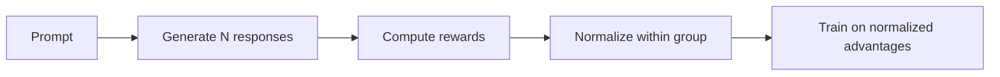

# GRPO (Group Relative Policy Optimization)

The default algorithm in Flux. Groups multiple responses per prompt and uses relative rankings for advantage estimation.

## Overview

GRPO normalizes rewards within groups of responses to the same prompt, providing more stable training signal than per-sample reward.

**Key idea**: Instead of using absolute rewards, use *relative* rewards within a group.

## How It Works



1. Generate `group_size` responses for each prompt
2. Compute rewards for all responses
3. Normalize within each group: $A_i = \frac{r_i - \mu}{\sigma}$
4. Train on normalized advantages

## Advantage Formula

$$
A_i = \frac{r_i - \mu_{group}}{\sigma_{group} + \epsilon}
$$

Where:
- $r_i$ = reward for response $i$
- $\mu_{group}$ = mean reward in the group
- $\sigma_{group}$ = std deviation in the group
- $\epsilon$ = small constant for stability

## Loss Function

Combines PPO-style clipping with KL regularization:

$$
L = -\text{clip}(r_t, 1-\epsilon, 1+\epsilon) \cdot A + \beta \cdot KL
$$

## Configuration

```yaml
algorithm:
  name: grpo
  clip_range: 0.2       # PPO clip range
  entropy_coef: 0.01    # Entropy bonus
  normalize_advantages: true
```

### Key Parameters

| Parameter | Default | Description |
|:----------|:--------|:------------|
| `clip_range` | `0.2` | Clipping for policy ratio |
| `beta` | `0.01` | KL penalty coefficient |
| `group_size` | `4` | Responses per prompt |
| `normalize_by_std` | `true` | Divide by group std |

## Usage

```python
from flux import FluxConfig, FluxTrainer

config = FluxConfig(
    model_path="Qwen/Qwen3-8B",
    algorithm="grpo",
    algorithm_config={
        "clip_range": 0.2,
        "group_size": 4,
    }
)

trainer = FluxTrainer(config)
trainer.fit(prompts="data.jsonl")
```

## When to Use

**Best for:**
- Multi-sample generation tasks
- High variance rewards
- When you can afford 4+ generations per prompt

**Advantages over PPO:**
- More stable gradients
- Better sample efficiency
- Less sensitive to reward scale

## Vectorized Implementation

For efficiency, Flux includes a vectorized variant:

```python
@register_adv_estimator("grpo_vectorized")
def compute_grpo_advantage_vectorized(
    token_level_rewards: torch.Tensor,
    response_mask: torch.Tensor,
    group_size: int = 4,
    **kwargs,
) -> tuple[torch.Tensor, torch.Tensor]:
    # Assumes batch is pre-organized as consecutive groups
    ...
```

This is ~2x faster when batches are already structured.

## Metrics

GRPO logs these metrics:

| Metric | Description |
|:-------|:------------|
| `actor/grpo_kl` | Approximate KL divergence |
| `actor/clip_frac` | Fraction of clipped samples |
| `actor/entropy` | Policy entropy |
| `actor/adv_mean` | Mean advantage |
| `actor/adv_std` | Advantage std |
| `actor/ratio_mean` | Mean policy ratio |

## See Also

- [PPO](ppo.md) - Classic alternative
- [Algorithms Overview](index.md) - All algorithms
- [Custom Algorithms](custom.md) - Create your own
