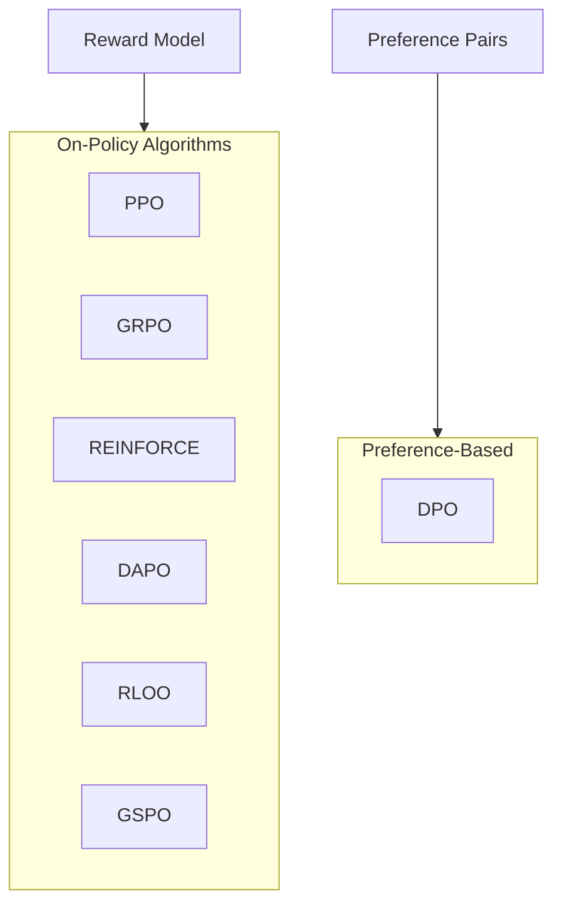
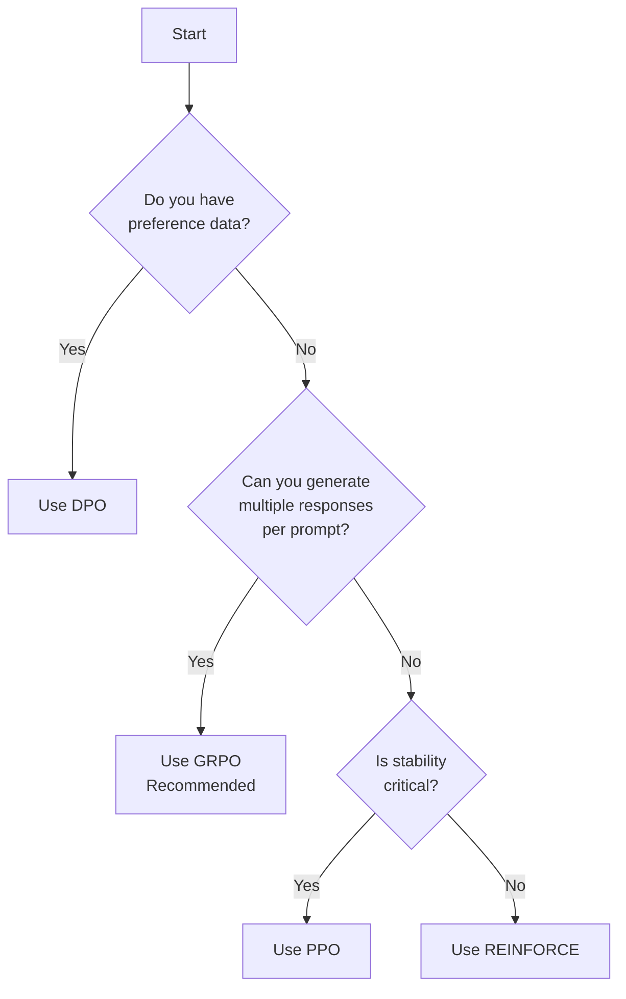

# Algorithms

Flux supports multiple reinforcement learning algorithms for LLM post-training. This guide helps you choose the right algorithm for your use case.

---

## Algorithm Overview



---

## Quick Comparison

| Algorithm | Type | Stability | Efficiency | Best For |
|:----------|:-----|:----------|:-----------|:---------|
| [**PPO**](ppo.md) | On-policy | ★★★★★ | ★★★☆☆ | General, stable training |
| [**GRPO**](grpo.md) | On-policy | ★★★★☆ | ★★★★★ | Multi-sample tasks |
| [**DPO**](dpo.md) | Preference | ★★★★☆ | ★★★★☆ | Preference data |
| [**REINFORCE**](reinforce.md) | On-policy | ★★★☆☆ | ★★★☆☆ | Simple baseline |
| [**DAPO**](dapo.md) | On-policy | ★★★★★ | ★★★☆☆ | High-variance rewards |
| [**RLOO**](rloo.md) | On-policy | ★★★★☆ | ★★★★☆ | Variance reduction |

---

## Choosing an Algorithm



### Decision Guide

| Your Situation | Recommended Algorithm |
|:---------------|:---------------------|
| Starting out, want something that works | **GRPO** (default) |
| Have preference pairs (chosen/rejected) | **DPO** |
| Need maximum stability | **PPO** |
| Working with high-variance rewards | **DAPO** |
| Want to reduce variance with multiple samples | **RLOO** |
| Simple baseline for comparison | **REINFORCE** |
| Large-scale distributed training | **GSPO** |

---

## Algorithm Details

### PPO (Proximal Policy Optimization)

The classic, battle-tested algorithm for RLHF.

```python
config = FluxConfig(
    algorithm="ppo",
    algorithm_config={
        "clip_ratio": 0.2,
        "kl_penalty": 0.1,
        "target_kl": 0.01,
    }
)
```

**Loss Function**:

$$L = -\min\left(\frac{\pi_\theta(a|s)}{\pi_{old}(a|s)} A, \text{clip}\left(\frac{\pi_\theta}{\pi_{old}}, 1-\epsilon, 1+\epsilon\right) A\right)$$

[:octicons-arrow-right-24: PPO Deep Dive](ppo.md)

---

### GRPO (Group Relative Policy Optimization)

**Default in Flux.** Groups multiple responses per prompt and uses relative rankings.

```python
config = FluxConfig(
    algorithm="grpo",
    algorithm_config={
        "group_size": 4,
        "baseline": "mean",
    }
)
```

**Advantage Estimation**:

$$A_i = \frac{r_i - \mu_{\text{group}}}{\sigma_{\text{group}}}$$

[:octicons-arrow-right-24: GRPO Deep Dive](grpo.md)

---

### DPO (Direct Preference Optimization)

Directly optimizes preferences without explicit reward model.

```python
config = FluxConfig(
    algorithm="dpo",
    algorithm_config={
        "beta": 0.1,
        "reference_free": False,
    }
)
```

**Loss Function**:

$$L = -\log \sigma\left(\beta \log \frac{\pi_\theta(y_w|x)}{\pi_{ref}(y_w|x)} - \beta \log \frac{\pi_\theta(y_l|x)}{\pi_{ref}(y_l|x)}\right)$$

[:octicons-arrow-right-24: DPO Deep Dive](dpo.md)

---

### REINFORCE

Basic policy gradient with reward-weighted log probabilities.

```python
config = FluxConfig(
    algorithm="reinforce",
    algorithm_config={
        "baseline": "moving_average",
        "baseline_decay": 0.99,
    }
)
```

**Loss Function**:

$$L = -\log \pi_\theta(a|s) \cdot (R - b)$$

[:octicons-arrow-right-24: REINFORCE Deep Dive](reinforce.md)

---

### DAPO (Decoupled Clip and Dynamic Sampling)

Advanced PPO variant with separate clipping for positive/negative advantages.

```python
config = FluxConfig(
    algorithm="dapo",
    algorithm_config={
        "clip_ratio_low": 0.2,
        "clip_ratio_high": 0.28,
        "dynamic_sampling": True,
        "token_level_loss": True,
    }
)
```

[:octicons-arrow-right-24: DAPO Deep Dive](dapo.md)

---

### RLOO (REINFORCE Leave-One-Out)

Uses leave-one-out baseline for variance reduction.

```python
config = FluxConfig(
    algorithm="rloo",
    algorithm_config={
        "num_samples": 4,
    }
)
```

**Advantage**:

$$A_i = r_i - \frac{1}{n-1} \sum_{j \neq i} r_j$$

[:octicons-arrow-right-24: RLOO Deep Dive](rloo.md)

---

## Importance Correction

All algorithms in Flux support **importance weight correction** for off-policy data:

```python
# Automatically applied when using async training
importance_weight = clip(
    exp(current_logprobs - behavior_logprobs),
    min=0.5,
    max=2.0
)

# Staleness decay
staleness_weight = decay ** version_gap

# Final weight
weight = importance_weight * staleness_weight
```

This allows algorithms to work correctly even when training on slightly stale data.

---

## Custom Algorithms

Flux makes it easy to add custom algorithms using the registry pattern:

```python
from flux.training.algorithms.base import (
    register_adv_estimator,
    register_policy_loss,
)

@register_adv_estimator("my_advantage")
def compute_my_advantage(rewards, mask, **kwargs):
    advantages = rewards - rewards.mean()
    returns = rewards
    return advantages, returns

@register_policy_loss("my_loss")
def compute_my_loss(old_logp, logp, advantages, mask, **kwargs):
    ratio = torch.exp(logp - old_logp)
    loss = -(ratio * advantages * mask).sum() / mask.sum()
    metrics = {"loss": loss.item()}
    return loss, metrics

# Use in config
config = FluxConfig(
    algorithm="my_loss",
    algorithm_config={
        "advantage_estimator": "my_advantage",
    }
)
```

[:octicons-arrow-right-24: Custom Algorithms Guide](custom.md)

---

## Hyperparameter Recommendations

### Learning Rate

| Model Size | Recommended LR |
|:-----------|:---------------|
| < 1B | 1e-5 to 5e-6 |
| 1B - 10B | 5e-6 to 1e-6 |
| 10B - 70B | 1e-6 to 5e-7 |
| > 70B | 5e-7 to 1e-7 |

### Clip Ratio (PPO/DAPO)

- `0.1`: Conservative, very stable
- `0.2`: Standard, good balance
- `0.3`: Aggressive, faster learning

### Group Size (GRPO/RLOO)

- `4`: Good cost/benefit balance
- `8`: Better estimates, 2x compute
- `16`: Best estimates, 4x compute

---

## Debugging Tips

### Loss Not Decreasing

1. Check reward scale (normalize to [-1, 1])
2. Reduce learning rate
3. Increase batch size
4. Check for NaN in log probs

### Training Unstable

1. Add KL penalty
2. Reduce learning rate
3. Reduce async ratio
4. Use DAPO instead of PPO

### Poor Sample Efficiency

1. Try GRPO or RLOO
2. Increase group size
3. Enable curriculum learning
4. Check reward function quality

---

## Next Steps

- **[PPO Deep Dive](ppo.md)** - Detailed PPO guide
- **[GRPO Deep Dive](grpo.md)** - Detailed GRPO guide
- **[Custom Algorithms](custom.md)** - Create your own
- **[Tutorials](../tutorials/index.md)** - Hands-on examples
