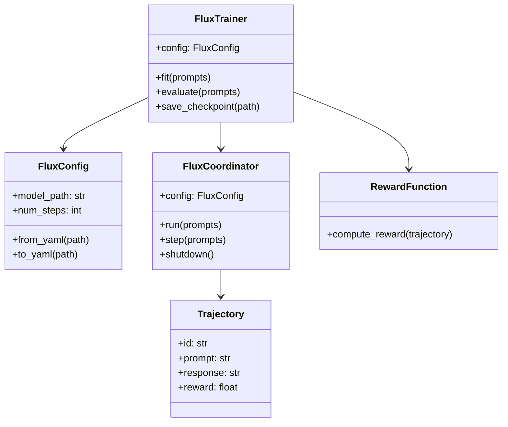

# API Reference

Complete reference documentation for all Flux classes and functions.

---

## Core Classes

<div class="grid cards" markdown>

-   :material-cog:{ .lg .middle } **[FluxConfig](config.md)**

    ---

    Main configuration class for all Flux settings

-   :material-school:{ .lg .middle } **[FluxTrainer](trainer.md)**

    ---

    High-level trainer interface for easy training

-   :material-sitemap:{ .lg .middle } **[FluxCoordinator](coordinator.md)**

    ---

    Low-level coordinator for custom training loops

-   :material-chart-timeline:{ .lg .middle } **[Trajectory](trajectory.md)**

    ---

    Data structure for storing generated responses

-   :material-star:{ .lg .middle } **[Rewards](rewards.md)**

    ---

    Reward function classes and utilities

-   :material-brain:{ .lg .middle } **[Algorithms](algorithms.md)**

    ---

    RL algorithm implementations

-   :material-tools:{ .lg .middle } **[Utilities](utilities.md)**

    ---

    Helper classes and functions

</div>

---

## Quick Import Reference

```python
# Main classes
from flux import FluxConfig, FluxTrainer

# Configuration
from flux.core.config import (
    FluxConfig,
    AdaptiveAsyncConfig,
    RolloutConfig,
    BatchComposerConfig,
    WeightSyncConfig,
    CheckpointConfig,
)

# Coordinator
from flux.coordinator import FluxCoordinator

# Trajectories
from flux.core.trajectory import Trajectory, TrajectoryBuffer

# Rewards
from flux.rewards import (
    RewardFunction,
    LengthReward,
    FormatReward,
    KeywordReward,
    CompositeReward,
    FunctionReward,
    RewardModel,
    LLMJudge,
)

# Algorithms
from flux.training.algorithms import (
    register_adv_estimator,
    register_policy_loss,
    get_adv_estimator,
    get_policy_loss,
)

# Utilities
from flux.utils import (
    CheckpointManager,
    GracefulShutdown,
    with_retry,
    MetricsRegistry,
)

# Types
from flux.core.types import (
    PromptsType,
    MetricsDict,
    StateDict,
)
```

---

## Class Hierarchy



---

## Common Usage Patterns

### Basic Training

```python
from flux import FluxConfig, FluxTrainer

config = FluxConfig(
    model_path="Qwen/Qwen3-8B",
    num_steps=1000,
)

trainer = FluxTrainer(config)
result = trainer.fit(prompts="data/prompts.jsonl")
```

### Custom Reward Function

```python
from flux import FluxTrainer
from flux.rewards import FunctionReward

def my_reward(traj):
    return 1.0 if "answer" in traj.response.lower() else 0.0

trainer = FluxTrainer(
    config,
    reward_function=FunctionReward(my_reward),
)
```

### Custom Training Loop

```python
from flux.coordinator import FluxCoordinator

async def custom_training():
    coordinator = FluxCoordinator(config)
    await coordinator.initialize()

    async for result in coordinator.run(prompts):
        print(f"Step {result.step}: {result.loss}")

        if result.loss < 0.1:
            break

    await coordinator.shutdown()
```

### Custom Algorithm

```python
from flux.training.algorithms.base import register_policy_loss

@register_policy_loss("my_loss")
def compute_my_loss(old_logp, logp, advantages, mask, **kwargs):
    ratio = torch.exp(logp - old_logp)
    loss = -(ratio * advantages * mask).sum() / mask.sum()
    return loss, {"loss": loss.item()}
```

---

## Type Annotations

Flux uses comprehensive type annotations:

```python
from flux.core.types import (
    PromptsType,      # list[str] | list[dict] | str (file path)
    MetricsDict,      # dict[str, float]
    StateDict,        # dict[str, torch.Tensor]
    CallbackType,     # Callable[[CoordinatorState, MetricsDict], None]
    StepCallbackType, # Callable[[StepResult], None]
)
```

---

## Version Compatibility

| Flux Version | Python | PyTorch | CUDA |
|:-------------|:-------|:--------|:-----|
| 0.1.x | 3.10+ | 2.0+ | 12.0+ |

---

## See Also

- **[Getting Started](../getting-started/index.md)** - Installation and quick start
- **[Tutorials](../tutorials/index.md)** - Step-by-step guides
- **[How-to Guides](../how-to/index.md)** - Task-specific guides
