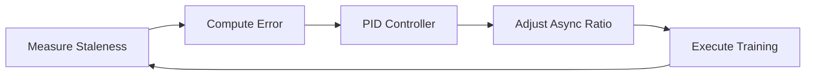

# Adaptive Async Control

The core innovation in Flux is **adaptive async control** - dynamically adjusting the balance between synchronous and asynchronous training based on real-time measurements.

---

## The Problem

Traditional RLHF frameworks force a binary choice:

### Synchronous Training (VERL-style)

```
┌─────────────────────────────────────────────────────────┐
│                   Synchronous Training                   │
├─────────────────────────────────────────────────────────┤
│                                                         │
│  Step 1:  [Generate][Generate][Generate][   WAIT   ]   │
│  Step 2:  [  Train  ][  Train  ][  Train  ]            │
│  Step 3:  [Generate][Generate][Generate][   WAIT   ]   │
│                                                         │
│  GPU Utilization: ~45%  (lots of waiting)              │
│  Staleness: 0 (perfect)                                 │
│  Stability: ★★★★★                                       │
│                                                         │
└─────────────────────────────────────────────────────────┘
```

**Pros**: Fresh data, stable training
**Cons**: GPU bubbles, low throughput

### Asynchronous Training (AReaL-style)

```
┌─────────────────────────────────────────────────────────┐
│                   Asynchronous Training                  │
├─────────────────────────────────────────────────────────┤
│                                                         │
│  Gen:     [Gen][Gen][Gen][Gen][Gen][Gen][Gen][Gen]     │
│  Train:   [Train][Train][Train][Train][Train][Train]   │
│                                                         │
│  GPU Utilization: ~95%  (always busy)                  │
│  Staleness: High (old data)                             │
│  Stability: ★★★☆☆                                       │
│                                                         │
└─────────────────────────────────────────────────────────┘
```

**Pros**: High GPU utilization, fast throughput
**Cons**: Training on stale data, potential instability

---

## The Flux Solution

Flux treats sync/async as a **continuous spectrum** controlled by a PID controller:

```
┌─────────────────────────────────────────────────────────┐
│                   Adaptive Training                      │
├─────────────────────────────────────────────────────────┤
│                                                         │
│  Early:   [Gen][Gen][ Wait ][Train][Gen][ Wait ]       │
│  Mid:     [Gen][Gen][Gen][Train][Train][Gen]           │
│  Late:    [Gen][Gen][Gen][Gen][Train][Gen][Gen]        │
│                                                         │
│  GPU Utilization: ~85%  (adaptive)                     │
│  Staleness: Controlled (~0.15)                          │
│  Stability: ★★★★☆                                       │
│                                                         │
└─────────────────────────────────────────────────────────┘
```

---

## How It Works

### The Control Loop



### Key Variables

| Variable | Range | Description |
|:---------|:------|:------------|
| `staleness` | [0, 1] | Current staleness measurement |
| `target_staleness` | [0, 1] | Desired staleness level |
| `async_ratio` | [0.1, 0.9] | Current sync/async balance |
| `error` | [-1, 1] | `target - current` staleness |

### PID Controller

```python
class AdaptiveAsyncController:
    def __init__(self, config):
        self.target = config.target_staleness
        self.kp = config.kp  # Proportional gain
        self.ki = config.ki  # Integral gain
        self.kd = config.kd  # Derivative gain

        self.async_ratio = 0.5
        self.integral = 0.0
        self.prev_error = 0.0

    def update(self, staleness: float) -> float:
        # Compute error
        error = self.target - staleness

        # PID terms
        self.integral += error
        derivative = error - self.prev_error
        self.prev_error = error

        # PID output
        adjustment = (
            self.kp * error +
            self.ki * self.integral +
            self.kd * derivative
        )

        # Update and clip
        self.async_ratio = clip(
            self.async_ratio + adjustment,
            min=0.1,  # Never fully sync
            max=0.9   # Never fully async
        )

        return self.async_ratio
```

---

## Async Ratio Effects

The `async_ratio` controls several subsystems:

### 1. Sync Policy

```python
# When to trigger a sync barrier
should_sync = (
    staleness > target + tolerance or
    steps_since_sync > max_steps or
    buffer_capacity <= 0
)
```

| Async Ratio | Sync Frequency | Behavior |
|:------------|:---------------|:---------|
| 0.1 (sync) | Every ~2 steps | Wait for fresh data |
| 0.5 (balanced) | Every ~10 steps | Mixed fresh/stale |
| 0.9 (async) | Every ~50 steps | Rarely wait |

### 2. Buffer Capacity

```python
# How many old trajectories to keep
max_buffer = (max_version_gap + 1) * batch_size
```

Higher async ratio → larger buffer → more old data allowed.

### 3. Batch Composition

```python
# How to mix fresh and stale data
fresh_ratio = 1.0 - async_ratio
stale_ratio = async_ratio

# Stratified sampling
batch = sample_stratified(
    fresh_trajectories, fresh_ratio,
    stale_trajectories, stale_ratio
)
```

---

## Configuration Guide

### Basic Configuration

```yaml
adaptive_async:
  target_staleness: 0.15  # Sweet spot for most tasks
  min_async_ratio: 0.1    # Never fully sync
  max_async_ratio: 0.9    # Never fully async
  kp: 0.1                 # Proportional gain
  ki: 0.01                # Integral gain
  kd: 0.05                # Derivative gain
```

### Tuning Guidelines

| Scenario | Recommended `target_staleness` | Notes |
|:---------|:------------------------------|:------|
| Stable training (default) | 0.15 | Good balance |
| Maximum throughput | 0.3-0.4 | Risk of instability |
| Critical stability | 0.05-0.1 | Slower but safer |
| Early training | 0.1 | Policy changing fast |
| Late fine-tuning | 0.25 | Policy stable |

### PID Tuning

| Gain | Too Low | Too High |
|:-----|:--------|:---------|
| `kp` | Slow response | Oscillation |
| `ki` | Steady-state error | Overshoot |
| `kd` | Overshoot | Noise sensitivity |

**Default values** (`kp=0.1, ki=0.01, kd=0.05`) work well for most cases.

---

## Monitoring

### Key Metrics

```python
# Log these during training
metrics = {
    "staleness/current": controller.staleness_ema,
    "staleness/target": controller.target_staleness,
    "async/ratio": controller.async_ratio,
    "async/error": controller.prev_error,
    "sync/count": controller.sync_count,
}
```

### Healthy Training Signs

- `staleness` oscillates around `target_staleness`
- `async_ratio` adjusts smoothly (not jumping)
- GPU utilization > 70%
- Loss decreasing steadily

### Warning Signs

- `staleness` consistently above target → increase sync
- `async_ratio` stuck at min/max → adjust target
- High loss variance → reduce `target_staleness`

---

## Advanced: Phase-Aware Control

For advanced users, Flux supports phase-aware control:

```python
config = FluxConfig(
    adaptive_async={
        "target_staleness": 0.15,
        "phase_schedule": {
            "warmup": {"target": 0.05, "steps": 100},
            "main": {"target": 0.15},
            "cooldown": {"target": 0.25, "steps": 50},
        }
    }
)
```

This automatically adjusts the target staleness based on training progress.

---

## Comparison

| Framework | Approach | Staleness Control |
|:----------|:---------|:------------------|
| VERL | Fixed sync | None (always 0) |
| AReaL | Fixed async | Staleness-aware PPO |
| Slime | Manual switch | APRIL strategy |
| **Flux** | **Adaptive** | **PID controller** |

---

## Next Steps

- **[Staleness & Importance](staleness.md)** - How staleness is measured
- **[APRIL Strategy](april.md)** - Efficient rollout generation
- **[Configuration Guide](../configuration/adaptive-async.md)** - Full configuration reference
