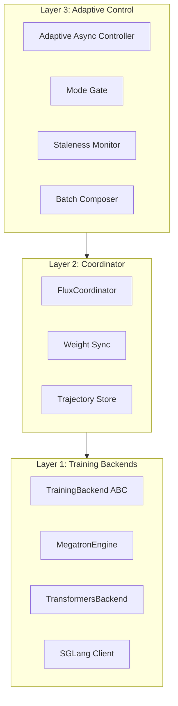

# Architecture Overview

Flux is designed with a three-layer architecture for maximum performance and flexibility.

## Architecture Diagram

<figure markdown="span">
  { loading=lazy width="100%" }
  <figcaption>Flux three-layer architecture with adaptive async control</figcaption>
</figure>

<div class="grid cards" markdown>

-   :material-file-edit:{ .lg .middle } **Interactive Diagram**

    ---

    Download [flux_architecture.drawio](../assets/flux_architecture.drawio) and open in [diagrams.net](https://app.diagrams.net/) to explore all 3 pages:

    - Page 1: High-level architecture
    - Page 2: Data flow & interactions
    - Page 3: Training loop state machine

    [:octicons-link-external-24: Open in diagrams.net](https://app.diagrams.net/){ .md-button }

</div>

## Three-Layer Design



## Components

### Layer 1: Training Backends

Flux uses a **native trainer contract** (`TrainingBackend` ABC) that enables GPU-direct training:

```python
from flux.training import TrainingBackend, GPUBatch, TrainStepResult

class TrainingBackend(ABC):
    @property
    def version(self) -> int: ...
    @property
    def device(self) -> torch.device: ...

    def initialize(self, config) -> None: ...
    def train_step(self, batch: GPUBatch) -> TrainStepResult: ...
    def get_state_dict(self) -> dict[str, torch.Tensor]: ...
    def set_state_dict(self, state_dict) -> None: ...
```

**Available Backends:**

| Backend | Class | Use Case |
|:--------|:------|:---------|
| **Transformers** | `TransformersBackend` | Development, single/multi-GPU with HuggingFace models |
| **Megatron** | `MegatronEngine` | Production with 3D parallelism (TP + PP + DP) |
| **FSDP** | `FSDPBackend` | Memory-efficient large model training (planned) |
| **DeepSpeed** | `DeepSpeedBackend` | ZeRO optimization stages (planned) |

**GPUBatch** - The frozen, device-owned batch format:

```python
@dataclass(frozen=True)
class GPUBatch:
    input_ids: torch.Tensor          # [B, seq]
    attention_mask: torch.Tensor     # [B, seq]
    behavior_log_probs: torch.Tensor # [B, seq]
    rewards: torch.Tensor            # [B] or [B, seq]
    version_gaps: torch.Tensor       # [B]
    # Optional: loss_mask, advantages, ref_log_probs, etc.
```

### Layer 2: Coordinator

The `FluxCoordinator` orchestrates the training loop:

- **Trajectory Store**: Hot buffer (GPU) + cold store (CPU) with version gating
- **Weight Sync**: CUDA IPC (same-node) or HTTP (cross-node) synchronization
- **Checkpoint Management**: Best model tracking, distributed checkpointing

### Layer 3: Adaptive Control

#### Mode Gate (State Machine)

The `ModeGate` controls sync/async transitions:

```python
from flux.controller import AsyncMode, ModeGate, ModeGateState

class AsyncMode(Enum):
    SYNC_BARRIER = auto()    # Waiting for in-flight rollouts
    ASYNC_RUNNING = auto()   # Normal async operation
    THROTTLED = auto()       # Backpressure active

class ModeGate:
    def evaluate(
        self,
        staleness: float,
        capacity: int,
        buffer_fill_ratio: float,
        in_flight: int,
    ) -> ModeGateState: ...

    def can_submit_rollout(self) -> bool: ...
    async def enforce_barrier(self, wait_fn) -> bool: ...
```

**State Transitions:**

| Condition | From | To | Action |
|:----------|:-----|:---|:-------|
| `staleness > threshold` | ASYNC_RUNNING | SYNC_BARRIER | Wait for in-flight |
| `capacity <= 0` | ASYNC_RUNNING | THROTTLED | Pause rollouts |
| `buffer > 90%` | ASYNC_RUNNING | THROTTLED | Pause rollouts |
| In-flight drained | SYNC_BARRIER | ASYNC_RUNNING | Resume |
| Capacity recovered | THROTTLED | ASYNC_RUNNING | Resume |

#### PID Controller

Dynamically adjusts `async_ratio` based on staleness:

```python
error = target_staleness - measured_staleness
output = kp * error + ki * ∫error + kd * d(error)/dt
async_ratio = clip(async_ratio + output, [0.1, 0.9])
```

#### Smart Batch Composer

Creates optimized training batches with:

- **Length bucketing**: Minimize padding waste
- **Staleness balancing**: Stratified sampling by version gap
- **Curriculum ordering**: Progressive difficulty

## Data Flow

```
┌─────────────────────────────────────────────────────────────────────────┐
│                           Training Loop                                   │
└─────────────────────────────────────────────────────────────────────────┘

1. Mode Gate Check
   │
   ├─► SYNC_BARRIER: Wait for in-flight, sync weights
   ├─► THROTTLED: Skip rollout submission
   └─► ASYNC_RUNNING: Continue

2. Submit Rollouts (if mode allows)
   │
   └─► SGLang generates responses → Trajectory Store

3. Sample Training Batch
   │
   └─► SmartBatchComposer → GPUBatch

4. Training Step
   │
   └─► TrainingBackend.train_step(batch) → TrainStepResult

5. Update Controllers
   │
   ├─► Staleness measurement
   ├─► PID controller update
   └─► Mode Gate threshold update

6. Conditional Weight Sync
   │
   └─► If staleness_manager.should_sync() → sync to SGLang
```

## Configuration

Backend selection via config:

```yaml
# Model and backend selection
model_path: "Qwen/Qwen3-8B"
training_backend: "transformers"  # or "megatron", "fsdp", "deepspeed"

# Training parameters (used by all backends)
learning_rate: 1e-6
weight_decay: 0.01
gradient_accumulation_steps: 4
batch_size: 32

# Megatron-specific settings (used when training_backend: "megatron")
megatron:
  tp_size: 4
  pp_size: 2
  dp_size: 1

# Mode gate settings
adaptive_async:
  target_staleness: 0.15
  staleness_threshold: 0.3
  capacity_low_watermark: 0
  buffer_high_watermark: 0.9
```

!!! note "Backend-Specific Configuration"
    The TransformersBackend reads training parameters from the top-level config
    (`model_path`, `learning_rate`, etc.). For Megatron-specific settings like
    tensor parallelism, use the nested `megatron:` block.

For detailed design, see [Technical Specification](../design/specification.md).
