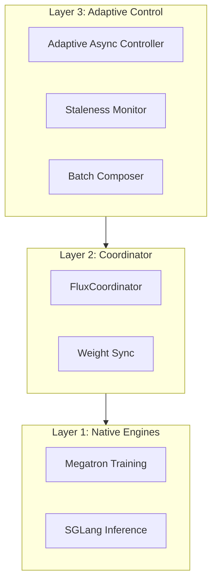

# Architecture Overview

Flux is designed with a three-layer architecture for maximum performance and flexibility.

## Three-Layer Design

## Components

### Layer 1: Native Engines
- **Megatron-LM**: Distributed training with 3D parallelism
- **SGLang**: High-performance inference server

### Layer 2: Coordinator
- Orchestrates training loop
- Manages weight synchronization
- Handles checkpointing

### Layer 3: Adaptive Control
- PID controller for async ratio
- Smart batch composition
- Staleness measurement

For detailed design, see [Technical Specification](../design/specification.md).
