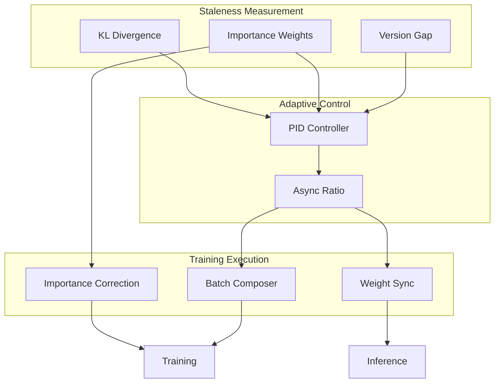
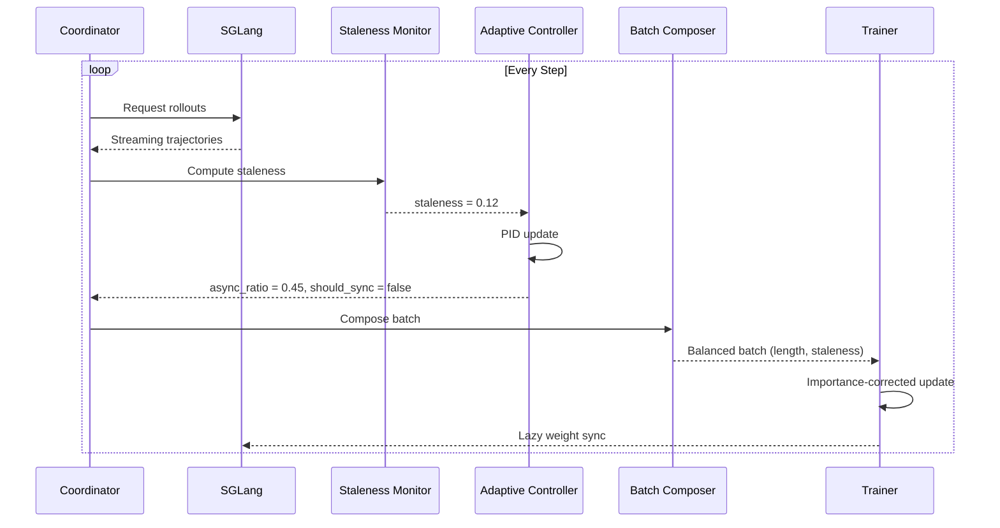

# Core Concepts

Understanding these concepts will help you get the most out of Flux and make informed decisions about your training configuration.

---

## Overview

Flux is built around several key innovations that together enable adaptive, efficient RLHF training:

<div class="grid cards" markdown>

-   :material-tune:{ .lg .middle } **Adaptive Async Control**

    ---

    Dynamic sync/async ratio adjustment based on real-time staleness measurements

    [:octicons-arrow-right-24: Learn more](adaptive-async.md)

-   :material-chart-timeline:{ .lg .middle } **Staleness & Importance**

    ---

    Quantifying and correcting for off-policy data in asynchronous training

    [:octicons-arrow-right-24: Learn more](staleness.md)

-   :material-rocket:{ .lg .middle } **APRIL Strategy**

    ---

    Active Partial Rollout for efficient long-tail handling

    [:octicons-arrow-right-24: Learn more](april.md)

-   :material-view-grid:{ .lg .middle } **Batch Composition**

    ---

    Smart batching for optimal padding and curriculum learning

    [:octicons-arrow-right-24: Learn more](batch-composition.md)

-   :material-sync:{ .lg .middle } **Weight Synchronization**

    ---

    Efficient weight transfer between training and inference

    [:octicons-arrow-right-24: Learn more](weight-sync.md)

-   :material-sitemap:{ .lg .middle } **Architecture**

    ---

    Three-layer architecture for maximum flexibility

    [:octicons-arrow-right-24: Learn more](architecture.md)

</div>

---

## The Big Picture

### The False Dichotomy

Traditional RLHF frameworks force a binary choice:

| Approach | Pros | Cons |
|:---------|:-----|:-----|
| **Synchronous** (VERL) | Stable training, fresh data | GPU bubbles, low utilization |
| **Asynchronous** (AReaL) | High throughput, no waiting | Staleness issues, instability |

Flux treats this as a **continuous spectrum**, not a binary choice.

### The Flux Approach

```
Sync ◄──────────────────────────────────────────────► Async
      │                                              │
      │  VERL                                 AReaL  │
      │  ████░░░░░░░░░░░░░░░░░░░░░░░░░░░░░░░████    │
      │                                              │
      │       ◄══════ Flux adapts here ══════►      │
      │                                              │
      └──────────────────────────────────────────────┘
```

Key insight: **The optimal configuration changes during training**

- Early training: More sync (policy changing rapidly)
- Mid training: Balanced (stable, efficient)
- Late training: More async (fine-tuning, policy stable)

---

## Concept Map



---

## Key Formulas

### Staleness Score

$$
\text{staleness} = 0.4 \cdot \text{KL}_{norm} + 0.3 \cdot \text{IW}_{norm} + 0.3 \cdot \text{version}_{norm}
$$

Where:

- $\text{KL}_{norm} = \min(1, \frac{D_{KL}(\pi_{behavior} \| \pi_{current})}{0.1})$
- $\text{IW}_{norm} = \min(1, \frac{\text{Var}(w)}{2.0})$
- $\text{version}_{norm} = \min(1, \frac{\text{version\_gap}}{5})$

### Importance Weight

$$
w = \exp\left(\frac{1}{T} \sum_t \log \frac{\pi_{current}(a_t|s_t)}{\pi_{behavior}(a_t|s_t)}\right) \cdot \gamma^{\text{version\_gap}}
$$

### PID Control

$$
\text{async\_ratio}_{t+1} = \text{clip}\left(\text{async\_ratio}_t + K_p e + K_i \int e \, dt + K_d \frac{de}{dt}, [0.1, 0.9]\right)
$$

Where $e = \text{target\_staleness} - \text{EMA(staleness)}$

---

## How They Work Together

### Training Step Flow



### Sync Decision Logic

```python
def should_sync(staleness, async_ratio, steps_since_sync):
    # Sync if staleness exceeds threshold
    if staleness > target_staleness + tolerance:
        return True

    # Sync if too many steps without sync
    if steps_since_sync > max_steps_between_sync:
        return True

    # Sync if buffer capacity low
    if buffer_capacity < min_capacity:
        return True

    return False
```

---

## Configuration Impact

| Concept | Key Config | Effect |
|:--------|:-----------|:-------|
| Adaptive Async | `target_staleness` | Higher = more async, faster but riskier |
| | `kp, ki, kd` | Controller responsiveness |
| Staleness | `staleness_decay` | How fast old data loses weight |
| APRIL | `oversample_ratio` | How much to oversample rollouts |
| | `batch_timeout` | When to abort long generations |
| Batch Composer | `length_bucket_boundaries` | Padding efficiency |
| | `curriculum_enabled` | Easy-to-hard ordering |
| Weight Sync | `method` | "full", "delta", "snapshot" |
| | `interval` | Steps between syncs |

---

## Deep Dives

Ready to learn more? Explore each concept in detail:

1. **[Adaptive Async Control](adaptive-async.md)** - The PID controller and sync/async balance
2. **[Staleness & Importance](staleness.md)** - Measuring and correcting for off-policy data
3. **[APRIL Strategy](april.md)** - Efficient rollout generation
4. **[Batch Composition](batch-composition.md)** - Smart batching strategies
5. **[Weight Synchronization](weight-sync.md)** - Efficient weight transfer
6. **[Architecture](architecture.md)** - System design and component interaction
