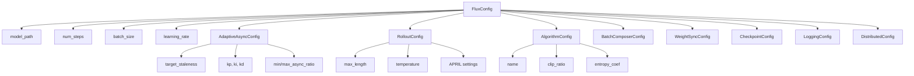

# Configuration Guide

Flux uses a hierarchical configuration system built on Pydantic. All configurations are validated at load time with sensible defaults.

---

## Quick Start

=== "YAML File"

    ```yaml title="config.yaml"
    model_path: Qwen/Qwen3-8B
    num_steps: 1000
    algorithm: grpo

    adaptive_async:
      target_staleness: 0.15
    ```

    ```python
    config = FluxConfig.from_yaml("config.yaml")
    ```

=== "Python"

    ```python
    from flux import FluxConfig

    config = FluxConfig(
        model_path="Qwen/Qwen3-8B",
        num_steps=1000,
        algorithm="grpo",
        adaptive_async={"target_staleness": 0.15},
    )
    ```

=== "Environment Variables"

    ```bash
    export FLUX_MODEL_PATH="Qwen/Qwen3-8B"
    export FLUX_NUM_STEPS=1000
    flux train --prompts data/prompts.jsonl
    ```

---

## Configuration Sections

<div class="grid cards" markdown>

-   :material-book:{ .lg .middle } **Full Reference**

    ---

    Complete list of all configuration options

    [:octicons-arrow-right-24: Reference](reference.md)

-   :material-school:{ .lg .middle } **Training Config**

    ---

    Learning rate, batch size, steps, and optimization

    [:octicons-arrow-right-24: Training](training.md)

-   :material-tune:{ .lg .middle } **Adaptive Async Config**

    ---

    Staleness targets and PID controller settings

    [:octicons-arrow-right-24: Adaptive Async](adaptive-async.md)

-   :material-play:{ .lg .middle } **Rollout Config**

    ---

    Generation settings and APRIL strategy

    [:octicons-arrow-right-24: Rollout](rollout.md)

-   :material-brain:{ .lg .middle } **Algorithm Config**

    ---

    PPO, GRPO, DPO, and other algorithm settings

    [:octicons-arrow-right-24: Algorithm](algorithm.md)

-   :material-file-document:{ .lg .middle } **Example Configs**

    ---

    Ready-to-use configuration templates

    [:octicons-arrow-right-24: Examples](examples.md)

</div>

---

## Configuration Hierarchy



---

## Common Configurations

### Stable Training (Default)

```yaml
model_path: Qwen/Qwen3-8B
num_steps: 5000
batch_size: 32
learning_rate: 1.0e-6

adaptive_async:
  target_staleness: 0.15
  min_async_ratio: 0.1
  max_async_ratio: 0.7

algorithm:
  name: grpo
  group_size: 4
```

### High Throughput

```yaml
model_path: Qwen/Qwen3-8B
num_steps: 10000
batch_size: 64
learning_rate: 5.0e-7

adaptive_async:
  target_staleness: 0.3  # Allow more staleness
  max_async_ratio: 0.9   # More async

rollout:
  april:
    oversample_ratio: 2.0
    batch_timeout: 20.0
```

### Maximum Stability

```yaml
model_path: Qwen/Qwen3-8B
num_steps: 5000
batch_size: 16
learning_rate: 5.0e-7

adaptive_async:
  target_staleness: 0.05  # Very fresh data
  max_async_ratio: 0.3    # Mostly sync

algorithm:
  name: ppo
  clip_ratio: 0.1
  kl_penalty: 0.2
```

---

## Validation

Flux validates all configuration at load time:

```python
from flux import FluxConfig
from pydantic import ValidationError

try:
    config = FluxConfig(
        model_path="invalid",
        num_steps=-1,  # Invalid!
    )
except ValidationError as e:
    print(f"Configuration errors: {e}")
```

Common validation errors:

| Error | Cause | Fix |
|:------|:------|:----|
| `num_steps must be positive` | Negative step count | Use positive integer |
| `learning_rate too high` | LR > 1e-4 | Use smaller LR |
| `invalid algorithm name` | Typo in algorithm | Check spelling |

---

## Environment Variables

Any config value can be overridden via environment:

```bash
# Format: FLUX_<SECTION>_<PARAMETER>
export FLUX_NUM_STEPS=2000
export FLUX_LEARNING_RATE=1e-6
export FLUX_ADAPTIVE_ASYNC_TARGET_STALENESS=0.2
export FLUX_ALGORITHM_NAME=ppo
```

Priority order (highest to lowest):

1. Explicit Python arguments
2. Environment variables
3. YAML file values
4. Default values

---

## Next Steps

- **[Full Reference](reference.md)** - All configuration options
- **[Example Configs](examples.md)** - Ready-to-use templates
- **[Getting Started](../getting-started/quickstart.md)** - Start training
