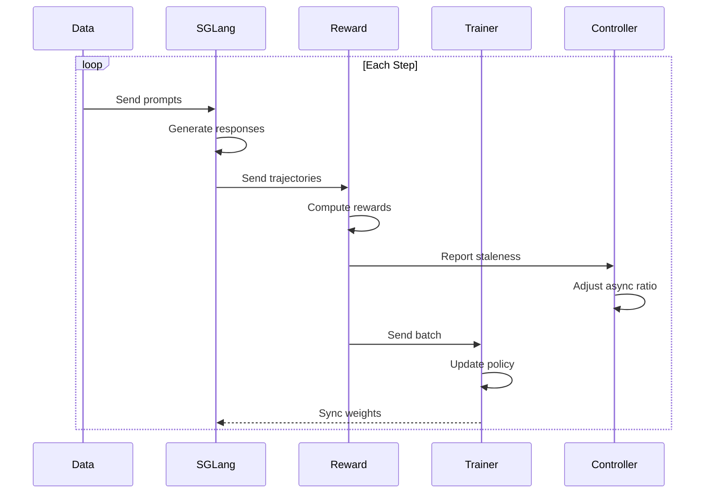

# Your First Training Run

This guide walks you through a complete training run with Flux, explaining each step along the way.

---

## What We'll Build

By the end of this tutorial, you'll have:

- [x] Trained a model to give better responses
- [x] Understood the training loop
- [x] Learned how to monitor training progress
- [x] Saved and evaluated your trained model

---

## Prerequisites

Before starting, ensure you have:

- Flux installed (`pip install flux-rlhf`)
- A GPU with 16GB+ memory
- SGLang running (`python -m sglang.launch_server ...`)

---

## Step 1: Prepare Your Data

Create a training dataset. For this example, we'll train a model to be more helpful:

```python title="prepare_data.py"
import json

# Sample training prompts
prompts = [
    {"prompt": "How do I sort a list in Python?"},
    {"prompt": "Explain what machine learning is."},
    {"prompt": "Write a haiku about coding."},
    {"prompt": "What's the capital of France?"},
    {"prompt": "How do I make a good cup of coffee?"},
    # Add more prompts for better results
]

# Save to JSONL
with open("train_prompts.jsonl", "w") as f:
    for p in prompts:
        f.write(json.dumps(p) + "\n")

print(f"Created {len(prompts)} training prompts")
```

---

## Step 2: Define a Reward Function

The reward function tells Flux what "good" responses look like:

```python title="rewards.py"
from flux.rewards import RewardFunction, RewardOutput
from flux.core.trajectory import Trajectory

class HelpfulnessReward(RewardFunction):
    """Reward responses that are helpful and well-structured."""

    def compute_reward(self, trajectory: Trajectory) -> RewardOutput:
        response = trajectory.response
        score = 0.0

        # Reward for reasonable length (50-300 words)
        word_count = len(response.split())
        if 50 <= word_count <= 300:
            score += 0.3
        elif word_count > 300:
            score += 0.1  # Slightly penalize verbose responses

        # Reward for structured responses
        if any(marker in response for marker in ["1.", "First", "•", "-"]):
            score += 0.2

        # Reward for explanations
        explanation_words = ["because", "therefore", "this means", "for example"]
        if any(word in response.lower() for word in explanation_words):
            score += 0.3

        # Penalize very short responses
        if word_count < 20:
            score -= 0.3

        # Normalize to [0, 1]
        score = max(0.0, min(1.0, score))

        return RewardOutput(
            reward=score,
            metadata={"word_count": word_count}
        )
```

---

## Step 3: Configure Training

Create a configuration that balances stability and efficiency:

```yaml title="config.yaml"
# Model
model_path: Qwen/Qwen3-8B

# SGLang server
sglang:
  base_url: http://localhost:8000

# Training settings
num_steps: 500
batch_size: 8
learning_rate: 5.0e-7

# Algorithm
algorithm:
  name: grpo
  group_size: 4

# Adaptive async (the magic!)
adaptive_async:
  target_staleness: 0.15
  min_async_ratio: 0.1
  max_async_ratio: 0.7

# Rollout settings
rollout:
  max_length: 512
  temperature: 0.8
  top_p: 0.95

# Checkpoints
checkpoint:
  save_steps: 100
  output_dir: ./checkpoints

# Logging
logging:
  log_steps: 10
  log_level: INFO
```

---

## Step 4: Run Training

```python title="train.py"
from flux import FluxConfig, FluxTrainer
from rewards import HelpfulnessReward

# Load configuration
config = FluxConfig.from_yaml("config.yaml")

# Create trainer with our reward function
trainer = FluxTrainer(
    config=config,
    reward_function=HelpfulnessReward(),
)

# Run training
print("Starting training...")
result = trainer.fit(prompts="train_prompts.jsonl")

# Print results
print("\n" + "="*50)
print("Training Complete!")
print("="*50)
print(f"Total steps: {result.total_steps}")
print(f"Final loss: {result.final_loss:.4f}")
print(f"Throughput: {result.samples_per_second:.1f} samples/sec")
print(f"Total time: {result.total_time_seconds/60:.1f} minutes")
```

Run it:

```bash
python train.py
```

---

## Step 5: Monitor Training

You should see output like:

```
Starting training...
[Step 10] loss=0.523 | reward=0.42 | staleness=0.08 | async=0.32
[Step 20] loss=0.487 | reward=0.48 | staleness=0.11 | async=0.38
[Step 30] loss=0.456 | reward=0.53 | staleness=0.14 | async=0.45
[Step 40] loss=0.428 | reward=0.57 | staleness=0.15 | async=0.48
...
```

### What to Look For

| Metric | Good Sign | Warning Sign |
|:-------|:----------|:-------------|
| `loss` | Decreasing | Increasing or NaN |
| `reward` | Increasing | Stuck or decreasing |
| `staleness` | Near target (0.15) | >> 0.3 |
| `async` | Stable or increasing | Stuck at min |

---

## Step 6: Evaluate Your Model

After training, evaluate the results:

```python title="evaluate.py"
from flux import FluxTrainer, FluxConfig

# Load trained model
config = FluxConfig.from_yaml("config.yaml")
trainer = FluxTrainer(config)
trainer.load_checkpoint("checkpoints/checkpoint-500")

# Test prompts
test_prompts = [
    "How do I learn a new programming language?",
    "What makes a good leader?",
    "Explain quantum computing simply.",
]

# Generate responses
for prompt in test_prompts:
    response = trainer.generate(prompt)
    print(f"\nPrompt: {prompt}")
    print(f"Response: {response[:200]}...")
```

---

## Step 7: Compare Before and After

```python title="compare.py"
# Compare original vs trained model responses

original_model = "Qwen/Qwen3-8B"
trained_model = "checkpoints/checkpoint-500"

prompt = "How should I prepare for a job interview?"

# Get responses from both
print("Original model:")
# ... generate with original

print("\nTrained model:")
# ... generate with trained
```

---

## Understanding the Training Loop

Here's what happened during training:



### Key Concepts

1. **Rollout Generation**: SGLang generates responses to prompts
2. **Reward Computation**: Your reward function scores each response
3. **Staleness Monitoring**: Controller tracks how fresh the data is
4. **Policy Update**: Model weights are updated based on rewards
5. **Weight Sync**: Updated weights are sent back to SGLang

---

## Common Issues

??? warning "Loss not decreasing"

    **Possible causes:**
    - Learning rate too high → try `1e-7`
    - Reward function issues → check reward distribution
    - Data quality → review prompts

??? warning "Low throughput"

    **Possible causes:**
    - GPU memory → reduce batch size
    - SGLang bottleneck → check server logs
    - Network issues → verify connectivity

??? warning "Training unstable"

    **Possible causes:**
    - High async ratio → reduce `max_async_ratio`
    - Reward variance → normalize rewards
    - Learning rate → reduce by 2-5x

---

## Next Steps

Congratulations! You've completed your first training run. Here's what to explore next:

<div class="grid cards" markdown>

-   **[Configuration Guide](configuration.md)**

    ---

    Learn all configuration options

-   **[Custom Rewards Tutorial](../tutorials/custom-rewards.md)**

    ---

    Build better reward functions

-   **[Multi-GPU Training](../tutorials/multi-gpu.md)**

    ---

    Scale up your training

-   **[Algorithms Guide](../algorithms/index.md)**

    ---

    Try different algorithms

</div>
