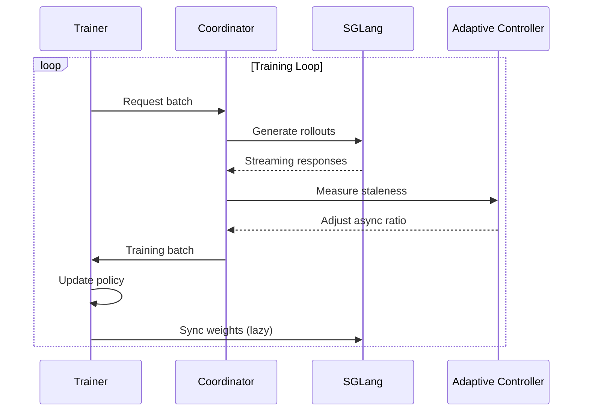

# Quick Start

Get your first Flux training running in under 10 minutes.

## Prerequisites

Before starting, ensure you have:

- [x] Flux installed (`pip install flux-rlhf`)
- [x] NVIDIA GPU with 16GB+ memory
- [x] SGLang installed (`pip install sglang[all]`)

---

## Step 1: Start SGLang Server

Flux uses SGLang for efficient inference. Start the server:

=== "Single GPU"

    ```bash
    python -m sglang.launch_server \
        --model-path Qwen/Qwen3-8B \
        --port 8000
    ```

=== "Multi-GPU (TP=4)"

    ```bash
    python -m sglang.launch_server \
        --model-path Qwen/Qwen3-8B \
        --port 8000 \
        --tp 4
    ```

Wait until you see:

```
INFO: Server started at http://0.0.0.0:8000
```

---

## Step 2: Prepare Training Data

Create a simple prompts file:

```bash
cat > prompts.jsonl << 'EOF'
{"prompt": "Explain quantum computing in simple terms."}
{"prompt": "Write a Python function to calculate Fibonacci numbers."}
{"prompt": "What are the benefits of regular exercise?"}
{"prompt": "Describe the process of photosynthesis."}
{"prompt": "How does machine learning differ from traditional programming?"}
EOF
```

---

## Step 3: Run Training

### Option A: Python Script

```python title="train.py"
from flux import FluxConfig, FluxTrainer

# Create configuration
config = FluxConfig(
    # Model settings
    model_path="Qwen/Qwen3-8B",

    # SGLang server
    sglang={"base_url": "http://localhost:8000"},

    # Training settings
    num_steps=100,
    batch_size=4,
    learning_rate=1e-6,

    # Algorithm (GRPO is default, efficient for multi-sample)
    algorithm="grpo",

    # Adaptive async (the magic!)
    adaptive_async={
        "target_staleness": 0.15,
        "min_async_ratio": 0.1,
        "max_async_ratio": 0.9,
    },
)

# Create trainer
trainer = FluxTrainer(config)

# Run training
result = trainer.fit(prompts="prompts.jsonl")

# Print results
print(f"Training complete!")
print(f"  Steps: {result.total_steps}")
print(f"  Final loss: {result.final_loss:.4f}")
print(f"  Throughput: {result.samples_per_second:.1f} samples/sec")
```

Run it:

```bash
python train.py
```

### Option B: CLI

```bash
flux train \
    --model Qwen/Qwen3-8B \
    --prompts prompts.jsonl \
    --num-steps 100 \
    --algorithm grpo
```

### Option C: YAML Configuration

```yaml title="config.yaml"
model_path: Qwen/Qwen3-8B

sglang:
  base_url: http://localhost:8000

training:
  num_steps: 100
  batch_size: 4
  learning_rate: 1.0e-6

algorithm:
  name: grpo
  group_size: 4

adaptive_async:
  target_staleness: 0.15
  min_async_ratio: 0.1
  max_async_ratio: 0.9
```

```bash
flux train --config config.yaml --prompts prompts.jsonl
```

---

## Step 4: Monitor Training

You should see output like:

```
[Step 10] loss=0.453 | staleness=0.08 | async_ratio=0.35 | throughput=8.2 samples/s
[Step 20] loss=0.412 | staleness=0.11 | async_ratio=0.42 | throughput=9.1 samples/s
[Step 30] loss=0.389 | staleness=0.13 | async_ratio=0.48 | throughput=10.3 samples/s
[Step 40] loss=0.367 | staleness=0.15 | async_ratio=0.52 | throughput=11.0 samples/s
                                         ↑ Controller stabilizing around target
[Step 50] loss=0.348 | staleness=0.14 | async_ratio=0.50 | throughput=10.8 samples/s
...
```

Key metrics to watch:

| Metric | What it means |
|:-------|:--------------|
| `loss` | Training loss (should decrease) |
| `staleness` | How stale the data is (target: ~0.15) |
| `async_ratio` | Current sync/async balance |
| `throughput` | Samples processed per second |

---

## What Just Happened?

Let's break down what Flux did:



1. **Coordinator** requests rollouts from SGLang
2. **SGLang** generates responses (streaming, with APRIL)
3. **Adaptive Controller** measures staleness and adjusts async ratio
4. **Trainer** updates policy with importance-corrected gradients
5. **Weight Sync** lazily updates SGLang with new weights

---

## Quick Customizations

### Custom Reward Function

```python
from flux import FluxConfig, FluxTrainer
from flux.rewards import FunctionReward

# Simple length-based reward
def my_reward(trajectory):
    # Reward longer responses (up to 200 tokens)
    length = len(trajectory.response.split())
    return min(length / 200, 1.0)

trainer = FluxTrainer(
    FluxConfig(model_path="Qwen/Qwen3-8B"),
    reward_function=FunctionReward(my_reward),
)
```

### Different Algorithm

```python
config = FluxConfig(
    model_path="Qwen/Qwen3-8B",
    algorithm="ppo",  # PPO instead of GRPO
    algorithm_config={
        "clip_ratio": 0.2,
        "kl_penalty": 0.1,
    },
)
```

### More Aggressive Async

```python
config = FluxConfig(
    model_path="Qwen/Qwen3-8B",
    adaptive_async={
        "target_staleness": 0.3,      # Allow more staleness
        "max_async_ratio": 0.95,      # More async
    },
)
```

---

## Common Issues

??? warning "SGLang server not responding"

    ```
    ConnectionError: Cannot connect to http://localhost:8000
    ```

    **Fix**: Ensure SGLang server is running and port is correct.

    ```bash
    curl http://localhost:8000/health
    ```

??? warning "Out of GPU memory"

    ```
    RuntimeError: CUDA out of memory
    ```

    **Fix**: Reduce batch size or use a smaller model.

    ```python
    config = FluxConfig(
        model_path="Qwen/Qwen3-0.5B",  # Smaller model
        batch_size=2,  # Smaller batch
    )
    ```

??? warning "Training not converging"

    **Fix**: Lower learning rate or increase batch size.

    ```python
    config = FluxConfig(
        learning_rate=5e-7,  # Lower LR
        batch_size=16,       # Larger batch
    )
    ```

---

## Next Steps

<div class="grid cards" markdown>

-   :material-school:{ .lg .middle } **First Training Run**

    ---

    Complete walkthrough with real data

    [:octicons-arrow-right-24: First Training](first-training.md)

-   :material-cog:{ .lg .middle } **Configuration**

    ---

    Understand all configuration options

    [:octicons-arrow-right-24: Configuration](configuration.md)

-   :material-book:{ .lg .middle } **Tutorials**

    ---

    In-depth tutorials for common tasks

    [:octicons-arrow-right-24: Tutorials](../tutorials/index.md)

-   :material-brain:{ .lg .middle } **Concepts**

    ---

    Understand how Flux works

    [:octicons-arrow-right-24: Concepts](../concepts/index.md)

</div>
