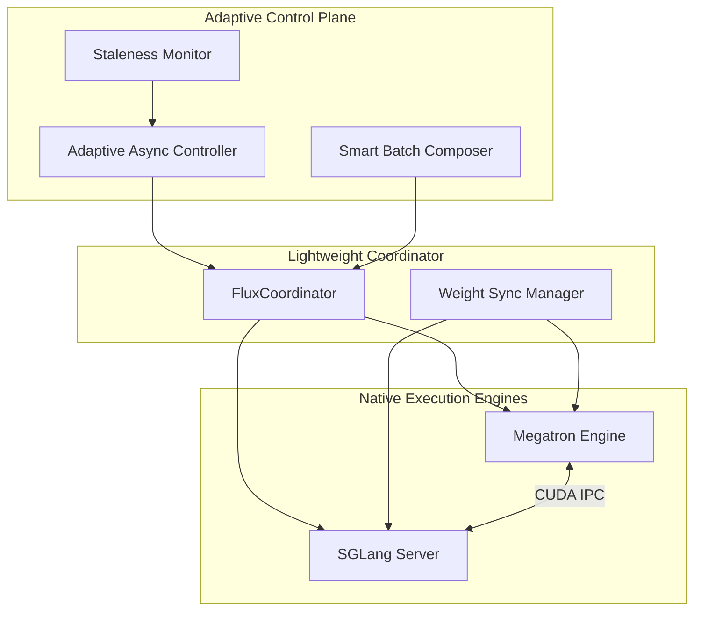

<style>
.md-content__button {
  display: none;
}
</style>

<div align="center" markdown>

# **Flux**

### Adaptive Post-Training Framework for LLMs

**The best of all worlds** — Synchronous stability + Asynchronous efficiency + Native simplicity

[:octicons-rocket-24: Get Started](getting-started/index.md){ .md-button .md-button--primary }
[:octicons-book-24: Tutorials](tutorials/index.md){ .md-button }
[:octicons-code-24: API Reference](api/index.md){ .md-button }

</div>

---

## Why Flux?

Existing RLHF frameworks force you to choose between **stability** (synchronous training) and **efficiency** (asynchronous training). Flux breaks this false dichotomy with **adaptive async control** that dynamically adjusts based on training dynamics.

<div class="grid cards" markdown>

-   :material-scale-balance:{ .lg .middle } **Adaptive Async**

    ---

    Dynamically adjusts sync/async ratio based on measured staleness. Get 85% GPU utilization with synchronous-level stability.

    [:octicons-arrow-right-24: Learn more](concepts/adaptive-async.md)

-   :material-lightning-bolt:{ .lg .middle } **Native Performance**

    ---

    Direct Megatron-LM + SGLang integration without Ray overhead. Maximum performance with minimal abstraction.

    [:octicons-arrow-right-24: Architecture](concepts/architecture.md)

-   :material-puzzle:{ .lg .middle } **Algorithm Agnostic**

    ---

    Support for PPO, GRPO, DPO, REINFORCE, DAPO, RLOO, and easy extensibility for custom algorithms.

    [:octicons-arrow-right-24: Algorithms](algorithms/index.md)

-   :material-code-tags:{ .lg .middle } **Simple & Extensible**

    ---

    Less than 5,000 lines of core code. Easy to understand, debug, and extend for your research needs.

    [:octicons-arrow-right-24: Contributing](contributing/index.md)

</div>

---

## The Spectrum, Not a Binary Choice

```
Sync ◄────────────────────────────────────────────────────► Async

     VERL        ████████████░░░░░░░░░░░░░░░░░░  Stable but slow
     AReaL       ░░░░░░░░░░░░░░░░░░████████████  Fast but risky
     Flux        ◄═══════ adapts here ═══════►  Best of both
```

Flux treats the sync/async ratio as a **continuous control variable**, not a binary choice. A PID controller maintains your target staleness level, automatically adjusting based on real-time training dynamics.

---

## Quick Comparison

| Aspect | VERL | AReaL | Slime | **Flux** |
|:-------|:----:|:-----:|:-----:|:--------:|
| Sync Strategy | Fixed sync | Fixed async | Both modes | **Adaptive** |
| Orchestration | Ray | Custom | HTTP | **asyncio** |
| Training Backend | Megatron/FSDP | Custom | Megatron | **Megatron** |
| Inference Backend | vLLM/SGLang | Custom | SGLang | **SGLang** |
| Weight Sync | Ray Object Store | Custom | CUDA IPC | **CUDA IPC** |
| Staleness Handling | N/A | Staleness-aware | APRIL | **Unified** |
| Code Complexity | ~15k LOC | ~25k LOC | ~8k LOC | **<5k LOC** |

---

## Quick Start

### Installation

```bash
pip install flux-rlhf

# Or from source
git clone https://github.com/flux-team/flux.git
cd flux && pip install -e ".[dev]"
```

### Basic Training

```python
from flux import FluxConfig, FluxTrainer

config = FluxConfig(
    model_path="Qwen/Qwen3-8B",
    adaptive_async={
        "target_staleness": 0.15,
        "min_async_ratio": 0.1,
        "max_async_ratio": 0.9,
    },
    algorithm="grpo",
)

trainer = FluxTrainer(config)
trainer.fit(prompts="data/prompts.jsonl")
```

[:octicons-arrow-right-24: Full Getting Started Guide](getting-started/index.md)

---

## Supported Algorithms

<div class="grid" markdown>

| Algorithm | Type | Best For |
|:----------|:-----|:---------|
| **[PPO](algorithms/ppo.md)** | On-policy | Stable general training |
| **[GRPO](algorithms/grpo.md)** | On-policy | Multi-sample efficiency |
| **[DPO](algorithms/dpo.md)** | Preference | Direct preference learning |
| **[REINFORCE](algorithms/reinforce.md)** | On-policy | Simple baselines |
| **[DAPO](algorithms/dapo.md)** | On-policy | High-variance rewards |
| **[RLOO](algorithms/rloo.md)** | On-policy | Variance reduction |

</div>

[:octicons-arrow-right-24: All Algorithms](algorithms/index.md)

---

## Architecture



[:octicons-arrow-right-24: Architecture Deep Dive](concepts/architecture.md)

---

## Performance Targets

| Metric | Target | Description |
|:-------|:-------|:------------|
| **GPU Utilization** | > 80% | Measured via nvidia-smi |
| **Throughput** | 2x VERL | Samples per hour |
| **Staleness** | Mean < 0.2 | Combined staleness metric |
| **Scaling** | > 85% at 64 GPUs | Linear scaling efficiency |

---

## Community

<div class="grid cards" markdown>

-   :fontawesome-brands-github:{ .lg .middle } **GitHub**

    ---

    Star the repo, report issues, and contribute code.

    [:octicons-arrow-right-24: flux-team/flux](https://github.com/flux-team/flux)

-   :fontawesome-brands-discord:{ .lg .middle } **Discord**

    ---

    Join our community for discussions and support.

    [:octicons-arrow-right-24: Join Discord](https://discord.gg/flux-rlhf)

-   :material-file-document:{ .lg .middle } **Documentation**

    ---

    Comprehensive guides, tutorials, and API reference.

    [:octicons-arrow-right-24: Read the Docs](getting-started/index.md)

</div>

---

## Citation

If you use Flux in your research, please cite:

```bibtex
@software{flux2025,
  title  = {Flux: An Adaptive Post-Training Framework for LLMs},
  year   = {2025},
  url    = {https://github.com/flux-team/flux}
}
```

---

<div align="center" markdown>

**Flux: Where stability meets efficiency**

[Apache 2.0 License](https://github.com/flux-team/flux/blob/main/LICENSE) ·
[Release Notes](changelog.md) ·
[Contributing](contributing/index.md)

</div>
