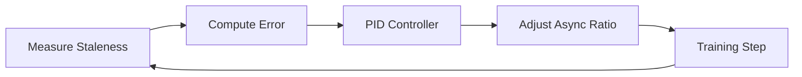

# Adaptive Async in Practice

Master the adaptive async controller for optimal training performance.

**Time**: 60 minutes
**Prerequisites**: [Multi-GPU Training](multi-gpu.md)

---

## Overview

The adaptive async controller is what makes Flux unique. In this tutorial, you'll learn:

- [x] How the PID controller works
- [x] Tuning staleness targets
- [x] Monitoring controller behavior
- [x] Debugging common issues
- [x] Advanced configuration

---

## Understanding the Controller

### The Control Loop



1. **Measure**: Compute staleness from batch
2. **Error**: `target_staleness - current_staleness`
3. **PID**: Compute adjustment using P, I, D terms
4. **Adjust**: Update async ratio within bounds
5. **Repeat**: Continuous feedback loop

### Key Variables

```python
# Target: Where we want staleness to be
target_staleness = 0.15

# Current: Measured staleness (EMA smoothed)
current_staleness = 0.12

# Error: Difference from target
error = target_staleness - current_staleness  # 0.03

# Async ratio: Current position on sync-async spectrum
async_ratio = 0.45  # 45% async
```

---

## Configuration Deep Dive

### Basic Configuration

```yaml
adaptive_async:
  # Target staleness level
  target_staleness: 0.15

  # Bounds on async ratio
  min_async_ratio: 0.1   # Never fully sync
  max_async_ratio: 0.9   # Never fully async

  # PID gains
  kp: 0.1   # Proportional
  ki: 0.01  # Integral
  kd: 0.05  # Derivative

  # Smoothing
  ema_alpha: 0.1  # EMA smoothing for staleness
```

### PID Tuning Guide

| Gain | Effect | Too Low | Too High |
|:-----|:-------|:--------|:---------|
| `kp` | Immediate response | Slow adaptation | Oscillation |
| `ki` | Steady-state correction | Offset from target | Windup, overshoot |
| `kd` | Dampening | Overshoot | Noise sensitivity |

**Starting Point**: `kp=0.1, ki=0.01, kd=0.05`

---

## Staleness Components

Staleness is computed from three signals:

```python
# 1. KL Divergence
kl = compute_kl(current_policy, behavior_policy)
kl_contrib = min(1.0, kl / 0.1)

# 2. Importance Weight Variance
iw_var = compute_iw_variance(batch)
iw_contrib = min(1.0, iw_var / 2.0)

# 3. Version Gap
version_gap = current_version - mean(batch_versions)
version_contrib = min(1.0, version_gap / 5)

# Combined (weighted sum)
staleness = 0.4 * kl_contrib + 0.3 * iw_contrib + 0.3 * version_contrib
```

---

## Monitoring

### Key Metrics to Track

```python
@trainer.add_step_callback
def log_adaptive_metrics(result):
    m = result.metrics
    print(f"Step {result.step}: "
          f"staleness={m['staleness']:.3f} "
          f"(target={m['target_staleness']:.3f}), "
          f"async_ratio={m['async_ratio']:.3f}, "
          f"error={m['pid_error']:.4f}")
```

### Healthy Behavior

```
Step 100: staleness=0.12 (target=0.15), async_ratio=0.42, error=0.030
Step 200: staleness=0.14 (target=0.15), async_ratio=0.48, error=0.010
Step 300: staleness=0.16 (target=0.15), async_ratio=0.45, error=-0.010
Step 400: staleness=0.15 (target=0.15), async_ratio=0.46, error=0.000
         ↑ Controller stabilizes around target
```

### Warning Signs

```
# Bad: Staleness stuck high
Step 100: staleness=0.35 (target=0.15), async_ratio=0.10  # Stuck at min!

# Bad: Oscillating wildly
Step 100: staleness=0.05, async_ratio=0.80
Step 101: staleness=0.30, async_ratio=0.15
Step 102: staleness=0.08, async_ratio=0.75
```

---

## Tuning Strategies

### Strategy 1: Conservative Start

For critical training or new tasks:

```yaml
adaptive_async:
  target_staleness: 0.10   # Low staleness
  max_async_ratio: 0.5     # Limited async
  kp: 0.05                 # Slower adaptation
```

### Strategy 2: High Throughput

When training is stable and you need speed:

```yaml
adaptive_async:
  target_staleness: 0.25   # Higher staleness OK
  max_async_ratio: 0.9     # More async allowed
  kp: 0.15                 # Faster adaptation
```

### Strategy 3: Phase-Aware

Different settings for different training phases:

```yaml
adaptive_async:
  target_staleness: 0.15
  phase_schedule:
    warmup:
      steps: 100
      target_staleness: 0.05  # Very fresh during warmup
    main:
      target_staleness: 0.15  # Normal during main training
    cooldown:
      steps: 50
      target_staleness: 0.25  # More async during cooldown
```

---

## Debugging Common Issues

### Issue: Staleness Too High

**Symptoms**: `staleness > target + 0.1` consistently

**Causes**:
1. Too many stale trajectories in buffer
2. Slow weight sync
3. SGLang inference too slow

**Solutions**:
```yaml
adaptive_async:
  max_version_gap: 3       # Reduce max staleness
  sync_threshold: 0.20     # Sync sooner

weight_sync:
  method: delta            # Faster sync
  interval: 1              # Sync every step
```

### Issue: Async Ratio Stuck at Minimum

**Symptoms**: `async_ratio = 0.1` (min) for many steps

**Causes**:
1. Target staleness too low
2. High staleness variance
3. Controller can't recover

**Solutions**:
```yaml
adaptive_async:
  target_staleness: 0.20   # Increase target
  kp: 0.15                 # Faster response
  min_async_ratio: 0.2     # Higher floor
```

### Issue: Oscillating Controller

**Symptoms**: Rapid swings between min/max async ratio

**Causes**:
1. PID gains too high
2. Measurement noise
3. Inconsistent workload

**Solutions**:
```yaml
adaptive_async:
  kp: 0.05                 # Reduce proportional
  kd: 0.1                  # Increase dampening
  ema_alpha: 0.05          # More smoothing
```

---

## Visualization

### Plot Controller Behavior

```python
import matplotlib.pyplot as plt

# Collect metrics during training
history = {"staleness": [], "async_ratio": [], "error": []}

@trainer.add_step_callback
def collect_metrics(result):
    history["staleness"].append(result.metrics["staleness"])
    history["async_ratio"].append(result.metrics["async_ratio"])
    history["error"].append(result.metrics["pid_error"])

# After training, plot
fig, axes = plt.subplots(3, 1, figsize=(10, 8))

axes[0].plot(history["staleness"])
axes[0].axhline(y=0.15, color='r', linestyle='--', label='target')
axes[0].set_ylabel("Staleness")
axes[0].legend()

axes[1].plot(history["async_ratio"])
axes[1].set_ylabel("Async Ratio")

axes[2].plot(history["error"])
axes[2].axhline(y=0, color='r', linestyle='--')
axes[2].set_ylabel("PID Error")
axes[2].set_xlabel("Step")

plt.tight_layout()
plt.savefig("controller_behavior.png")
```

---

## Advanced: Custom Controller

For research, you can implement a custom controller:

```python
from flux.controller import BaseAsyncController

class CustomController(BaseAsyncController):
    def __init__(self, config):
        super().__init__(config)
        self.history = []

    def update(self, staleness: float) -> float:
        self.history.append(staleness)

        # Custom logic: use moving average
        if len(self.history) > 10:
            trend = self.history[-1] - self.history[-10]
        else:
            trend = 0

        # Adjust based on trend
        if trend > 0.02:  # Staleness increasing
            self.async_ratio *= 0.95  # Reduce async
        elif trend < -0.02:  # Staleness decreasing
            self.async_ratio *= 1.05  # Increase async

        self.async_ratio = max(0.1, min(0.9, self.async_ratio))
        return self.async_ratio

# Use custom controller
config = FluxConfig(
    adaptive_async={"controller": CustomController}
)
```

---

## Next Steps

- **[Production Deployment](production.md)** - Scale to production
- **[Performance Optimization](../how-to/performance.md)** - Maximum throughput
- **[Concepts: Adaptive Async](../concepts/adaptive-async.md)** - Theory deep dive
