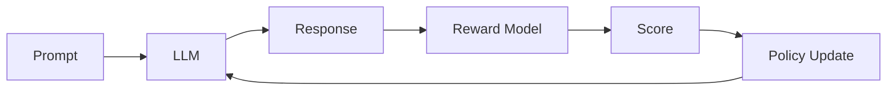

# Basic RLHF Training

Learn how to train an LLM with reinforcement learning from human feedback using Flux.

**Time**: 30 minutes
**Prerequisites**: Flux installed, GPU available

---

## Overview

In this tutorial, you'll learn:

- [x] What RLHF is and why it matters
- [x] How to set up a training environment
- [x] How to define reward functions
- [x] How to run and monitor training
- [x] How to evaluate results

---

## What is RLHF?

**Reinforcement Learning from Human Feedback** (RLHF) is a technique to align LLMs with human preferences:



1. **Generate**: LLM generates responses to prompts
2. **Score**: Reward function scores the responses
3. **Update**: Policy is updated to maximize rewards
4. **Repeat**: Continue until model is aligned

---

## Setup

### 1. Start SGLang Server

```bash
python -m sglang.launch_server \
    --model-path Qwen/Qwen3-8B \
    --port 8000
```

### 2. Prepare Data

```python
# Create training prompts
prompts = [
    "Explain machine learning to a 5-year-old.",
    "Write a professional email declining a meeting.",
    "How do I debug a Python program?",
    "What are the benefits of exercise?",
    "Summarize the plot of Romeo and Juliet.",
]

# Save to file
import json
with open("prompts.jsonl", "w") as f:
    for p in prompts:
        f.write(json.dumps({"prompt": p}) + "\n")
```

---

## Step 1: Define a Reward Function

The reward function defines what "good" means for your task:

```python
from flux.rewards import RewardFunction, RewardOutput
from flux.core.trajectory import Trajectory

class QualityReward(RewardFunction):
    """Reward clear, helpful, and concise responses."""

    def compute_reward(self, trajectory: Trajectory) -> RewardOutput:
        response = trajectory.response
        words = response.split()
        word_count = len(words)

        score = 0.0

        # 1. Length reward (50-200 words is ideal)
        if 50 <= word_count <= 200:
            score += 0.3
        elif word_count < 50:
            score += 0.1  # Too short
        else:
            score += 0.2  # Too long

        # 2. Clarity reward (check for structure)
        if any(x in response for x in ["First", "Second", "Finally", "1.", "2."]):
            score += 0.2

        # 3. Helpfulness (explanation markers)
        helpful_words = ["because", "therefore", "means", "example"]
        if any(w in response.lower() for w in helpful_words):
            score += 0.3

        # 4. Politeness
        polite_words = ["please", "thank", "hope", "glad"]
        if any(w in response.lower() for w in polite_words):
            score += 0.1

        # 5. Penalty for repetition
        unique_ratio = len(set(words)) / max(len(words), 1)
        if unique_ratio < 0.5:
            score -= 0.2

        return RewardOutput(
            reward=max(0.0, min(1.0, score)),
            metadata={"word_count": word_count, "unique_ratio": unique_ratio}
        )
```

---

## Step 2: Configure Training

```yaml title="config.yaml"
model_path: Qwen/Qwen3-8B

sglang:
  base_url: http://localhost:8000

num_steps: 500
batch_size: 8
learning_rate: 5.0e-7

algorithm:
  name: grpo
  group_size: 4

adaptive_async:
  target_staleness: 0.15

rollout:
  max_length: 512
  temperature: 0.8

checkpoint:
  save_steps: 100
  output_dir: ./checkpoints

logging:
  log_steps: 10
```

---

## Step 3: Run Training

```python title="train.py"
from flux import FluxConfig, FluxTrainer
from reward import QualityReward

# Load config
config = FluxConfig.from_yaml("config.yaml")

# Create trainer
trainer = FluxTrainer(
    config=config,
    reward_function=QualityReward(),
)

# Add callbacks for custom monitoring
@trainer.add_step_callback
def log_rewards(result):
    if result.step % 50 == 0:
        print(f"Step {result.step}: avg_reward={result.metrics['reward']:.3f}")

# Train!
result = trainer.fit(prompts="prompts.jsonl")

print(f"\nTraining complete!")
print(f"Final reward: {result.final_metrics['reward']:.3f}")
```

---

## Step 4: Monitor Training

### Console Output

```
[Step 10] loss=0.48 | reward=0.35 | staleness=0.08 | async=0.32
[Step 20] loss=0.44 | reward=0.42 | staleness=0.12 | async=0.41
[Step 30] loss=0.39 | reward=0.48 | staleness=0.14 | async=0.46
...
[Step 100] loss=0.28 | reward=0.62 | staleness=0.15 | async=0.52
```

### Key Metrics

| Metric | What to Watch |
|:-------|:--------------|
| `loss` | Should decrease over time |
| `reward` | Should increase over time |
| `staleness` | Should stay near target (0.15) |
| `async` | Should stabilize or increase |

### Warning Signs

- **Loss increasing**: Lower learning rate
- **Reward flat**: Check reward function
- **High staleness**: Reduce `max_async_ratio`

---

## Step 5: Evaluate Results

```python title="evaluate.py"
from flux import FluxTrainer, FluxConfig

# Load trained model
config = FluxConfig.from_yaml("config.yaml")
trainer = FluxTrainer(config)
trainer.load_checkpoint("checkpoints/best")

# Test prompts
test_prompts = [
    "How do I start learning to code?",
    "What makes a good presentation?",
    "Explain climate change briefly.",
]

# Compare before/after
print("Testing trained model:\n")
for prompt in test_prompts:
    response = trainer.generate(prompt, max_length=200)
    print(f"Q: {prompt}")
    print(f"A: {response}\n")
    print("-" * 50)
```

---

## Understanding the Results

### What Changed?

After RLHF training, your model should:

- Give more structured responses
- Be more concise (not too short, not too long)
- Include explanations and examples
- Be more polite and helpful

### Metrics Interpretation

```python
# Analyze training history
import matplotlib.pyplot as plt

# Plot reward over time
plt.figure(figsize=(10, 4))
plt.subplot(1, 2, 1)
plt.plot(result.reward_history)
plt.xlabel("Step")
plt.ylabel("Reward")
plt.title("Reward Over Training")

plt.subplot(1, 2, 2)
plt.plot(result.loss_history)
plt.xlabel("Step")
plt.ylabel("Loss")
plt.title("Loss Over Training")

plt.tight_layout()
plt.savefig("training_curves.png")
```

---

## Common Issues and Solutions

??? warning "Reward stays flat"

    **Causes:**
    - Reward function too sparse
    - Learning rate too low
    - Not enough training steps

    **Solutions:**
    - Add more fine-grained rewards
    - Increase learning rate by 2x
    - Run more steps (1000+)

??? warning "Training unstable"

    **Causes:**
    - Learning rate too high
    - Too much async
    - Reward function variance too high

    **Solutions:**
    - Reduce learning rate by 5x
    - Lower `max_async_ratio` to 0.5
    - Normalize rewards to [0, 1]

??? warning "Model degrades"

    **Causes:**
    - Reward hacking
    - KL divergence too high
    - Overfitting to prompts

    **Solutions:**
    - Add KL penalty to loss
    - Reduce training steps
    - Use more diverse prompts

---

## Next Steps

<div class="grid cards" markdown>

-   **[Custom Rewards](custom-rewards.md)**

    ---

    Build better reward functions

-   **[Multi-GPU Training](multi-gpu.md)**

    ---

    Scale up your training

-   **[Adaptive Async](adaptive-async.md)**

    ---

    Fine-tune the async controller

</div>

---

## Full Code

??? example "Complete training script"

    ```python
    """Complete RLHF training example."""
    import json
    from flux import FluxConfig, FluxTrainer
    from flux.rewards import RewardFunction, RewardOutput
    from flux.core.trajectory import Trajectory

    # Define reward function
    class QualityReward(RewardFunction):
        def compute_reward(self, trajectory: Trajectory) -> RewardOutput:
            response = trajectory.response
            words = response.split()
            word_count = len(words)

            score = 0.0

            # Length (50-200 words)
            if 50 <= word_count <= 200:
                score += 0.3
            elif word_count < 50:
                score += 0.1
            else:
                score += 0.2

            # Structure
            if any(x in response for x in ["First", "1.", "•"]):
                score += 0.2

            # Explanations
            if any(w in response.lower() for w in ["because", "means"]):
                score += 0.3

            # Politeness
            if any(w in response.lower() for w in ["please", "thank"]):
                score += 0.1

            return RewardOutput(reward=max(0, min(1, score)))

    # Main training
    def main():
        # Create config
        config = FluxConfig(
            model_path="Qwen/Qwen3-8B",
            sglang={"base_url": "http://localhost:8000"},
            num_steps=500,
            batch_size=8,
            learning_rate=5e-7,
            algorithm="grpo",
            adaptive_async={"target_staleness": 0.15},
        )

        # Create trainer
        trainer = FluxTrainer(config, reward_function=QualityReward())

        # Train
        result = trainer.fit(prompts="prompts.jsonl")

        print(f"Training complete! Final reward: {result.final_metrics['reward']:.3f}")

    if __name__ == "__main__":
        main()
    ```
