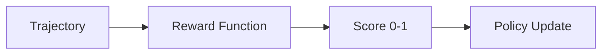

# Custom Reward Functions

Learn how to build reward functions tailored to your specific training objectives.

**Time**: 20 minutes
**Prerequisites**: [Basic RLHF Training](basic-rlhf.md)

---

## Overview

Reward functions are the heart of RLHF training. They define what "good" means for your model. In this tutorial, you'll learn:

- [x] How reward functions work in Flux
- [x] Built-in reward functions
- [x] Creating custom reward functions
- [x] Combining multiple rewards
- [x] Best practices and debugging

---

## How Rewards Work



A reward function takes a `Trajectory` (prompt + response) and returns a score:

```python
from flux.rewards import RewardFunction, RewardOutput
from flux.core.trajectory import Trajectory

class MyReward(RewardFunction):
    def compute_reward(self, trajectory: Trajectory) -> RewardOutput:
        # Access the response
        response = trajectory.response

        # Compute your score (0 to 1)
        score = self._compute_score(response)

        return RewardOutput(reward=score)
```

---

## Built-in Rewards

Flux provides several ready-to-use reward functions:

### LengthReward

Rewards responses of a target length:

```python
from flux.rewards import LengthReward

# Reward responses around 200 words
reward = LengthReward(target_length=200, reward_type="gaussian")
```

### FormatReward

Rewards structured responses:

```python
from flux.rewards import FormatReward

reward = FormatReward(
    required_sections=["Introduction", "Conclusion"],
    forbidden_patterns=["I don't know", "As an AI"],
)
```

### KeywordReward

Rewards presence of specific keywords:

```python
from flux.rewards import KeywordReward

reward = KeywordReward(
    required_keywords=["because", "therefore"],
    bonus_keywords=["example", "specifically"],
    penalty_keywords=["maybe", "perhaps"],
)
```

### FunctionReward

Quick custom reward from a function:

```python
from flux.rewards import FunctionReward

def my_scorer(trajectory):
    return 1.0 if "answer" in trajectory.response.lower() else 0.0

reward = FunctionReward(fn=my_scorer)
```

---

## Creating Custom Rewards

### Basic Custom Reward

```python
from flux.rewards import RewardFunction, RewardOutput
from flux.core.trajectory import Trajectory

class PoliteReward(RewardFunction):
    """Reward polite and respectful responses."""

    def __init__(self, weight: float = 1.0):
        self.weight = weight
        self.polite_words = ["please", "thank you", "appreciate", "glad"]
        self.rude_words = ["stupid", "dumb", "idiot", "whatever"]

    def compute_reward(self, trajectory: Trajectory) -> RewardOutput:
        response = trajectory.response.lower()

        # Count polite words
        polite_count = sum(1 for w in self.polite_words if w in response)

        # Count rude words (negative)
        rude_count = sum(1 for w in self.rude_words if w in response)

        # Compute score
        score = min(1.0, polite_count * 0.2) - rude_count * 0.3
        score = max(0.0, min(1.0, score))  # Clamp to [0, 1]

        return RewardOutput(
            reward=score * self.weight,
            metadata={
                "polite_count": polite_count,
                "rude_count": rude_count,
            }
        )
```

### Using External Models

```python
from flux.rewards import RewardFunction, RewardOutput
from transformers import pipeline

class SentimentReward(RewardFunction):
    """Reward positive sentiment responses."""

    def __init__(self):
        self.classifier = pipeline(
            "sentiment-analysis",
            model="distilbert-base-uncased-finetuned-sst-2-english"
        )

    def compute_reward(self, trajectory: Trajectory) -> RewardOutput:
        result = self.classifier(trajectory.response[:512])[0]

        if result["label"] == "POSITIVE":
            score = result["score"]
        else:
            score = 1.0 - result["score"]

        return RewardOutput(reward=score)
```

---

## Combining Rewards

Use `CompositeReward` to combine multiple reward signals:

```python
from flux.rewards import CompositeReward, LengthReward, KeywordReward

# Combine with weights
reward = CompositeReward([
    (LengthReward(target=150), 0.3),      # 30% weight
    (KeywordReward(required=["because"]), 0.3),  # 30% weight
    (PoliteReward(), 0.4),                # 40% weight
])
```

The final reward is a weighted sum of all components.

---

## Best Practices

### 1. Normalize to [0, 1]

```python
# Good: Normalized score
score = max(0.0, min(1.0, raw_score))

# Bad: Unbounded score
score = raw_score  # Could be -100 or +1000
```

### 2. Avoid Sparse Rewards

```python
# Bad: Binary reward (sparse)
score = 1.0 if perfect_response else 0.0

# Good: Gradual reward (dense)
score = 0.3 * has_greeting + 0.3 * has_content + 0.4 * has_conclusion
```

### 3. Log Metadata

```python
return RewardOutput(
    reward=score,
    metadata={
        "length": len(response),
        "keyword_matches": matches,
        "sub_scores": {"format": 0.3, "content": 0.7},
    }
)
```

### 4. Test Your Reward

```python
# Test with example responses
test_cases = [
    ("Good response with explanation because...", 0.8),
    ("Bad", 0.1),
    ("Medium length response", 0.5),
]

for response, expected in test_cases:
    traj = Trajectory(response=response)
    result = reward.compute_reward(traj)
    print(f"Score: {result.reward:.2f} (expected ~{expected})")
```

---

## Debugging Rewards

### Check Reward Distribution

```python
# During training, log reward statistics
@trainer.add_step_callback
def log_reward_stats(result):
    rewards = result.metrics.get("rewards", [])
    if rewards:
        print(f"Reward: mean={np.mean(rewards):.3f}, "
              f"std={np.std(rewards):.3f}, "
              f"min={np.min(rewards):.3f}, "
              f"max={np.max(rewards):.3f}")
```

### Common Issues

| Issue | Symptom | Solution |
|:------|:--------|:---------|
| Reward hacking | High reward, bad outputs | Add diversity penalties |
| Sparse rewards | Slow learning | Add intermediate rewards |
| High variance | Unstable training | Normalize, reduce LR |

---

## Next Steps

- **[Basic RLHF Training](basic-rlhf.md)** - Use your reward in training
- **[Multi-GPU Training](multi-gpu.md)** - Scale up training
- **[Algorithms Guide](../algorithms/index.md)** - Choose the right algorithm
