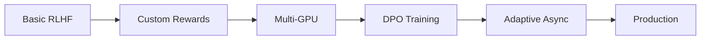

# Tutorials

Hands-on tutorials to help you master Flux for various RLHF training scenarios.

---

## Learning Path



---

## Beginner Tutorials

<div class="grid cards" markdown>

-   :material-school:{ .lg .middle } **Basic RLHF Training**

    ---

    Complete walkthrough of training an LLM with RLHF using Flux.

    **Time**: 30 minutes
    **Prerequisites**: Flux installed

    [:octicons-arrow-right-24: Start Tutorial](basic-rlhf.md)

-   :material-star:{ .lg .middle } **Custom Reward Functions**

    ---

    Learn to create custom reward functions for your specific task.

    **Time**: 20 minutes
    **Prerequisites**: Basic RLHF tutorial

    [:octicons-arrow-right-24: Start Tutorial](custom-rewards.md)

</div>

---

## Intermediate Tutorials

<div class="grid cards" markdown>

-   :material-server:{ .lg .middle } **Multi-GPU Training**

    ---

    Scale your training across multiple GPUs on a single node.

    **Time**: 45 minutes
    **Prerequisites**: Basic training working

    [:octicons-arrow-right-24: Start Tutorial](multi-gpu.md)

-   :material-compare:{ .lg .middle } **Fine-tuning with DPO**

    ---

    Use Direct Preference Optimization for preference learning.

    **Time**: 30 minutes
    **Prerequisites**: Preference data available

    [:octicons-arrow-right-24: Start Tutorial](dpo-training.md)

</div>

---

## Advanced Tutorials

<div class="grid cards" markdown>

-   :material-tune-vertical:{ .lg .middle } **Adaptive Async in Practice**

    ---

    Deep dive into configuring and monitoring adaptive async control.

    **Time**: 60 minutes
    **Prerequisites**: Multi-GPU training

    [:octicons-arrow-right-24: Start Tutorial](adaptive-async.md)

-   :material-factory:{ .lg .middle } **Production Deployment**

    ---

    Deploy Flux training at scale with monitoring and fault tolerance.

    **Time**: 90 minutes
    **Prerequisites**: All previous tutorials

    [:octicons-arrow-right-24: Start Tutorial](production.md)

</div>

---

## Quick Reference

| Tutorial | Difficulty | Time | Key Topics |
|:---------|:-----------|:-----|:-----------|
| [Basic RLHF](basic-rlhf.md) | Beginner | 30 min | FluxTrainer, GRPO, basic config |
| [Custom Rewards](custom-rewards.md) | Beginner | 20 min | RewardFunction, FunctionReward |
| [Multi-GPU](multi-gpu.md) | Intermediate | 45 min | TP, DP, distributed training |
| [DPO Training](dpo-training.md) | Intermediate | 30 min | DPO algorithm, preference data |
| [Adaptive Async](adaptive-async.md) | Advanced | 60 min | PID tuning, staleness monitoring |
| [Production](production.md) | Advanced | 90 min | Monitoring, checkpoints, scaling |

---

## Tutorial Format

Each tutorial follows a consistent structure:

1. **Overview** - What you'll learn
2. **Prerequisites** - What you need before starting
3. **Setup** - Environment and data preparation
4. **Step-by-Step** - Detailed instructions
5. **Verification** - How to know it worked
6. **Troubleshooting** - Common issues and solutions
7. **Next Steps** - Where to go from here

---

## Sample Projects

Complete example projects you can clone and run:

### Math Reasoning (GSM8K)

Train a model for mathematical reasoning using GRPO.

```bash
git clone https://github.com/flux-team/flux-examples
cd flux-examples/math-reasoning
./run.sh
```

### Code Generation (HumanEval)

Train a model for code generation with custom evaluation.

```bash
git clone https://github.com/flux-team/flux-examples
cd flux-examples/code-generation
./run.sh
```

### Chat Assistant (UltraChat)

Build a general-purpose chat assistant.

```bash
git clone https://github.com/flux-team/flux-examples
cd flux-examples/chat-assistant
./run.sh
```

---

## Video Tutorials

Coming soon! Subscribe to our YouTube channel for video walkthroughs.

---

## Community Tutorials

Have you written a tutorial about Flux? [Submit it here](https://github.com/flux-team/flux/issues/new?template=tutorial.md) and we'll feature it!

---

## Getting Help

Stuck on a tutorial? Here's how to get help:

1. Check the [FAQ](../getting-started/index.md#faq)
2. Search [GitHub Issues](https://github.com/flux-team/flux/issues)
3. Ask on [Discord](https://discord.gg/flux-rlhf)
4. Open a new issue with the `tutorial-help` label
